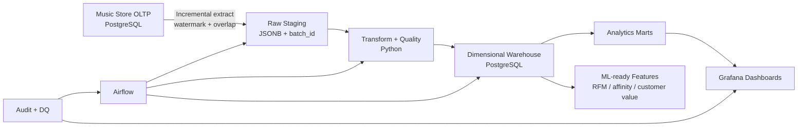
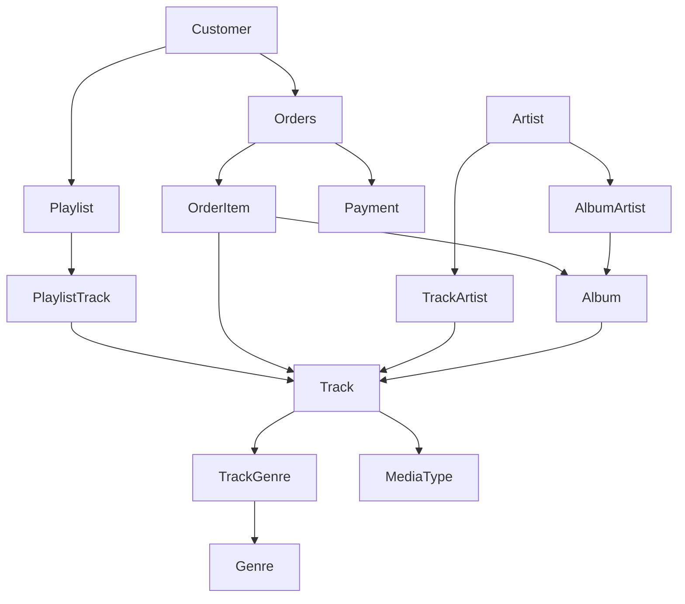
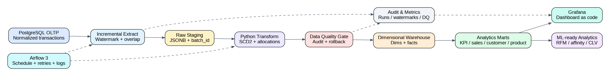
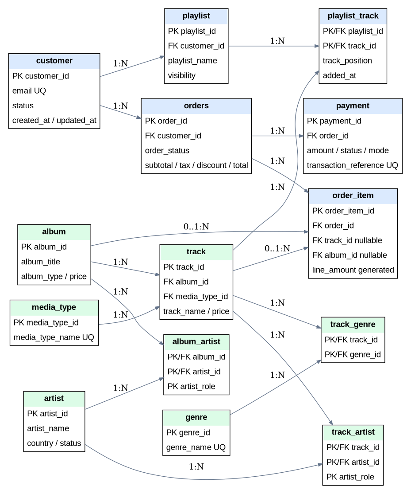
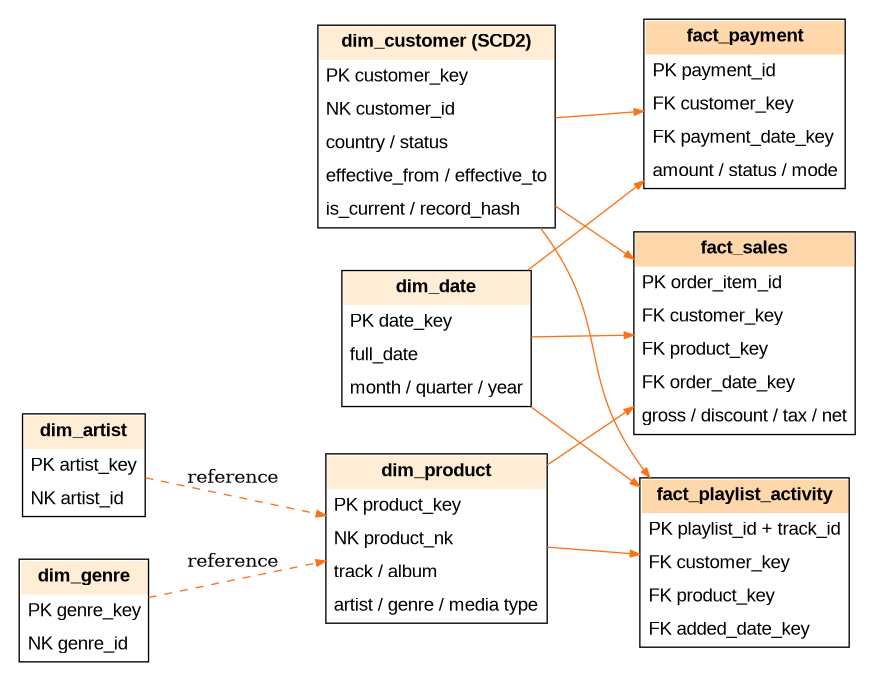

# Music Store Production Data Platform

Production-shaped **Data Engineering + Data Analytics** portfolio project built on PostgreSQL. It evolves the original Music Store OLTP schema into an end-to-end platform with incremental ingestion, raw staging, dimensional warehousing, SCD Type 2 history, data-quality gates, Airflow orchestration, Grafana dashboards, CI tests, auditability, and deployment guidance.

> Local Docker Compose is intended for an end-to-end portfolio/demo environment. The production deployment blueprint uses managed PostgreSQL, Kubernetes/managed Airflow, external secrets, TLS and centralized observability.

## What this project demonstrates

- OLTP database modelling with PK/FK/check/unique constraints, indexes and triggers
- Incremental extraction with persisted watermarks and overlap windows
- Idempotent upserts and rerunnable pipelines
- Append-only raw staging with 30-day local retention
- SCD Type 2 customer history
- Surrogate dimensions and star-schema facts
- Exact line-level tax/discount allocation with rounding reconciliation
- Data quality as a deployment gate
- Structured JSON pipeline logs and ETL audit tables
- Airflow scheduling, retries and concurrency protection
- Grafana dashboard-as-code provisioning
- Analytics marts for revenue, customer, product, payment and playlist analysis
- RFM segmentation, cohort analysis, product affinity and operational ETL analytics
- Dockerized local deployment and GitHub Actions CI
- Production Kubernetes/managed-service deployment blueprint

## End-to-end architecture



## OLTP domains



## Warehouse star schema

```mermaid
erDiagram
    DIM_CUSTOMER ||--o{ FACT_SALES : customer_key
    DIM_PRODUCT ||--o{ FACT_SALES : product_key
    DIM_DATE ||--o{ FACT_SALES : order_date_key
    DIM_CUSTOMER ||--o{ FACT_PAYMENT : customer_key
    DIM_DATE ||--o{ FACT_PAYMENT : payment_date_key
    DIM_CUSTOMER ||--o{ FACT_PLAYLIST_ACTIVITY : customer_key
    DIM_PRODUCT ||--o{ FACT_PLAYLIST_ACTIVITY : product_key
    DIM_DATE ||--o{ FACT_PLAYLIST_ACTIVITY : added_date_key

    DIM_CUSTOMER {
      bigint customer_key PK
      bigint customer_id NK
      text email
      text country
      text status
      timestamptz effective_from
      timestamptz effective_to
      boolean is_current
      char record_hash
    }
    DIM_PRODUCT {
      bigint product_key PK
      text product_nk NK
      text product_type
      bigint track_id
      bigint album_id
      text primary_artist
      text primary_genre
      numeric unit_price
    }
    FACT_SALES {
      bigint order_item_id PK
      bigint order_id
      bigint customer_key FK
      bigint product_key FK
      int order_date_key FK
      numeric gross_amount
      numeric allocated_discount
      numeric allocated_tax
      numeric net_amount
    }
    FACT_PAYMENT {
      bigint payment_id PK
      bigint customer_key FK
      int payment_date_key FK
      numeric amount
      text payment_status
      text payment_mode
    }
```

Generated diagrams are also available in [`docs/`](docs/).

### Rendered architecture



### Rendered OLTP ERD



### Rendered Warehouse Star Schema



## Repository structure

```text
.
├── airflow/dags/                 # Airflow 3 DAG
├── analytics/                    # Interview-grade analytical SQL
├── docker/                       # Pipeline and Airflow images
├── docs/                         # Architecture, ERDs, data model, runbook
├── grafana/                      # Datasource + dashboard provisioning
├── scripts/                      # Deterministic synthetic data generator
├── sql/
│   ├── oltp/                     # Operational schema, triggers, seed, views, role template
│   └── warehouse/                # Audit/staging/dim/fact schema, marts, role template
├── src/music_store_pipeline/     # Incremental ETL implementation
├── tests/                        # Unit tests
├── .github/workflows/            # CI pipeline
├── docker-compose.yml
├── Makefile
├── pyproject.toml
└── .env.example
```

## Data engineering design

### Incremental extraction

Large/change-heavy entities use `updated_at` watermarks:

- customer
- orders/order_item sales changes
- payment
- playlist activity

The pipeline subtracts a configurable overlap window from the stored watermark. Because target loads are idempotent, overlapping extraction protects against boundary-time misses without duplicating facts.

Products are intentionally refreshed as a full reference snapshot in this portfolio implementation. This is documented as a low-volume reference-table strategy and can be replaced by CDC at scale.

### Raw staging

Every extraction is persisted to:

```sql
staging.raw_record(
    batch_id,
    entity_name,
    natural_key,
    payload,
    source_updated_at,
    extracted_at
)
```

This gives replay/audit/debug visibility without coupling the warehouse schema directly to source tables.

### SCD Type 2

`warehouse.dim_customer` preserves historical customer attributes using:

- surrogate `customer_key`
- natural `customer_id`
- `effective_from`
- `effective_to`
- `is_current`
- SHA-256 record hash

Facts resolve the customer dimension **as of the business event timestamp**, not simply the current customer row.

### Fact grain

| Fact | Grain |
|---|---|
| `fact_sales` | one row per OLTP `order_item` |
| `fact_payment` | one row per payment attempt/transaction |
| `fact_playlist_activity` | one row per playlist-track relationship |

### Order allocation

Order-level tax and discount are proportionally allocated to line items. The final line absorbs any cent-level rounding remainder so that line totals reconcile exactly to the stored order total.

### Idempotency and concurrency

- facts are upserted by source business keys
- dimensions use deterministic natural keys
- watermarks move only forward
- a PostgreSQL advisory lock prevents concurrent runs of the same pipeline
- Airflow also uses `max_active_runs=1`

## Data quality gates

The pipeline records every check in `audit.dq_result` and fails the run when an error-severity check fails.

Included checks:

- exactly one current SCD2 row per customer
- non-negative sales components
- net sales formula reconciliation
- fact-to-dimension referential integrity
- positive payments
- pipeline freshness warning

## Audit and observability

`audit.etl_run` records:

- run ID
- pipeline
- status
- start/end time
- extracted rows
- loaded rows
- error details

`audit.pipeline_metric` records entity row counts and extraction duration. Structured JSON logs are emitted by the Python pipeline and are captured by Airflow.

## Analytics marts

The project exposes reusable marts:

- `marts.kpi_overview`
- `marts.daily_sales`
- `marts.monthly_sales`
- `marts.genre_performance`
- `marts.artist_performance`
- `marts.customer_value`
- `marts.payment_performance`
- `marts.playlist_engagement`
- `marts.customer_rfm`

The `analytics/interview_grade_queries.sql` file additionally demonstrates:

- month-over-month growth
- CLV
- RFM segmentation
- payment failure hotspots
- repeat purchase rate
- country contribution
- product affinity
- cohort retention base tables
- ETL reliability
- failed DQ analysis

## Grafana dashboard

The dashboard is provisioned as code and includes:

- completed revenue
- completed orders
- average order value
- purchasing customers
- 90-day daily revenue trend
- top genres
- top artists
- latest ETL run status

Open Grafana at `http://localhost:3000` after starting the stack.

## Airflow orchestration

The DAG runs hourly and includes:

- retries
- retry delay
- execution timeout
- no catchup
- one active pipeline run at a time

Open Airflow at `http://localhost:8080`.

## Quick start

### Prerequisites

- Docker Engine / Docker Desktop
- Docker Compose v2
- Make (optional)

### 1. Configure

```bash
cp .env.example .env
```

Change the default passwords before shared use.

### 2. Start the platform

```bash
docker compose up -d --build
```

or:

```bash
make up
```

### 3. Generate realistic demo data

```bash
make seed
```

Default portfolio seed creates approximately:

- 500 customers
- 80 artists
- 160 albums
- 1,800 tracks
- 4,000 orders
- thousands of order items, payments and playlist interactions

### 4. Run ETL once

```bash
make etl
```

Run it again to demonstrate idempotency/incremental behavior.

### 5. Query marts

```bash
docker compose exec warehouse-db \
  psql -U "$WAREHOUSE_USER" -d "$WAREHOUSE_DB" \
  -c "SELECT * FROM marts.kpi_overview;"
```

### 6. Open analytics

- Grafana: `http://localhost:3000`
- Airflow: `http://localhost:8080`

## Local reset

```bash
make reset
make seed
make etl
```

`make reset` destroys local Docker volumes. Do not use it against shared environments.

## Testing

Install local development dependencies:

```bash
python -m venv .venv
source .venv/bin/activate
pip install -e '.[dev]'
```

Run:

```bash
pytest -q
ruff check src tests scripts airflow/dags
```

## CI/CD

GitHub Actions validates:

1. Python linting
2. unit tests
3. PostgreSQL OLTP schema creation
4. warehouse schema creation
5. synthetic test data generation
6. end-to-end ETL execution
7. KPI mart query

This catches both code defects and SQL/schema integration defects before merge.

## Production deployment blueprint

The repository separates **local reproducibility** from **production architecture**.

Recommended production target:

```text
Managed PostgreSQL OLTP
        |
Private network + TLS
        v
Airflow on Kubernetes / managed Airflow
        |
        +--> Object storage raw/archive zone (optional at scale)
        |
        v
Managed PostgreSQL / analytical warehouse
        |
        +--> Grafana / enterprise BI
        +--> ML feature pipelines
```

Production controls documented in [`deploy/production/README.md`](deploy/production/README.md) include:

- managed databases with HA/backups/PITR
- Kubernetes/managed Airflow instead of local Compose
- secret manager integration
- TLS and private networking
- least-privilege DB roles
- immutable images
- resource requests/limits and autoscaling
- centralized logs/metrics/alerts
- schema migration strategy
- backup/restore testing
- DQ SLOs and pipeline SLAs
- blue/green or controlled rollout

## Portfolio interview talking points

Be prepared to explain:

1. Why OLTP and analytical workloads are separated.
2. Why `fact_sales` grain is one order item.
3. Why SCD2 is used for customer but SCD1 for product in this version.
4. How watermark + overlap + idempotent upsert prevents missed/duplicate data.
5. Why advisory locking and Airflow `max_active_runs=1` are both useful.
6. Why full-snapshot product extraction is acceptable here and how CDC would replace it.
7. How line allocation reconciles order-level totals.
8. Why dashboards query marts rather than the OLTP database.
9. How data quality blocks bad warehouse loads.
10. How this design would evolve to object storage, CDC, Spark/dbt and a cloud warehouse at higher scale.

## Future extensions

- PostgreSQL logical replication / Debezium CDC
- S3/GCS/ADLS bronze raw zone
- dbt transformation layer and semantic models
- Spark for high-volume transformations
- Great Expectations/Soda integration
- OpenLineage/Marquez
- Prometheus metrics and alerting
- customer recommendation model
- churn / purchase-propensity model
- feature store
- Terraform cloud infrastructure

## License

MIT License. See [`LICENSE`](LICENSE).
